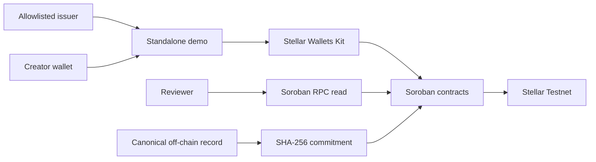

<div align="center">


# ByahéBITES Stellar Credential Layer

### Public proof for the places that matter

**Issue once. Verify anywhere.**

ByahéBITES adds a portable, publicly inspectable proof layer for MSME readiness
and creator contributions. It anchors only the public verification fields and
SHA-256 commitments on Stellar Soroban, while keeping personal data and raw
content off-chain.


[Open the live demo](https://github-import-jugawayne.replit.app/) ·
[Product site](https://byahebites.app/) ·
[Testnet evidence](deployments/testnet.json) ·
[Verification guide](docs/verification-guide.md) ·
[Run locally](#-run-the-demo-locally)

</div>

> [!IMPORTANT]
> **This is a Stellar Testnet prototype, not an adoption report.** No external
> MSMEs or creators have been onboarded for this sprint. Any sample records used
> for QA are synthetic Testnet fixtures controlled by the team and must not be
> represented as participant adoption, pilot results, or production evidence.

---

## 📸 See the proof layer

The standalone demo shows the credential and contribution flows, wallet-backed
transaction handling, and public lookup states.

<p align="center">
  <a href="artifacts/byahebites-stellar-integration/docs/images/demo.jpg">
    
  </a>
</p>

**Start here:** [open the published demo](https://github-import-jugawayne.replit.app/)
or follow the [reviewer verification guide](docs/verification-guide.md).

## 🧩 What this project is

Tourism trust signals can live in private databases, paper certificates, or
platform-specific records. The ByahéBITES Stellar layer makes a small,
well-defined part of that evidence independently inspectable:

- **MSME readiness** issued by an allowlisted issuer and associated with a
  PSGC-coded jurisdiction.
- **Creator contribution proofs** that link a creator, MSME, circuit, and
  canonical content commitment.
- **Public verification** through Soroban RPC and Stellar Expert Testnet links.
- **Fail-closed behavior** when a record is unavailable, malformed, duplicated,
  on the wrong network, or cannot be verified.

This repository contains the Stellar layer and a minimal standalone demo. It
does not replace the ByahéBITES product, an LGU console, editorial systems, or
TPB/DOT dashboards.

## ✨ What you can do today

### Reviewers

1. Open the [published demo](https://github-import-jugawayne.replit.app/).
2. Confirm the interface is operating against **Stellar Testnet**.
3. Inspect the two deployed contracts and their deployment and initialization
   transactions in the [evidence table](#-current-testnet-contracts).
4. Follow the wallet-free and wallet-backed checks in the
   [verification guide](docs/verification-guide.md).
5. Reproduce the evidence consistency check with
   `pnpm run validate:testnet-evidence`.

### Integrators

- Read the [MSME Credential Contract README](contracts/msme-credential/README.md).
- Read the [Creator Contribution Contract README](contracts/creator-contribution/README.md).
- Use the [integration guide](docs/integration-guide.md) for frontend, API, and
  contract boundaries.
- Use the [deployment guide](docs/deployment-guide.md) for Testnet-only
  release steps.

### Contributors

- Run the Rust contract tests with the pinned toolchain.
- Run the TypeScript typechecks and evidence validator.
- Start the standalone web demo and API locally.
- Keep public records reproducible and never commit signing material.

## 🌐 How ByahéBITES uses Stellar

The demo uses Stellar Wallets Kit for wallet connection and signing, Soroban
RPC for reads, and wallet-authorized transactions for writes. The browser does
not treat a local success state as proof: a write is only presented as
successful after submission and finality checks complete.



<p align="center">
  
</p>

The architecture intentionally separates:

1. **Content layer** — editorial and creator records that remain off-chain.
2. **Platform layer** — existing or future ByahéBITES, LGU, and tourism systems.
3. **Stellar layer** — the two Soroban contracts and the standalone verifier
   delivered in this sprint.

## 🔗 Current Testnet contracts

The evidence snapshot below was recorded on **2026-08-31 UTC** on **Stellar
Testnet**. The canonical machine-readable record is
[`deployments/testnet.json`](deployments/testnet.json).

| Contract | Contract ID | Deployment transaction | Initialization transaction | WASM SHA-256 |
| --- | --- | --- | --- | --- |
| MSME Credential | [`CBFGWVFTPC5L3NEEZ3XMO6W3MR3X5OKVSYZ5QVL7D5VT4EYZKHBBNSQ3`](https://stellar.expert/explorer/testnet/contract/CBFGWVFTPC5L3NEEZ3XMO6W3MR3X5OKVSYZ5QVL7D5VT4EYZKHBBNSQ3) | [`21382e968dfee7a1c1bc0ad5d427e9ecc7ab52f44e6a199b44e7de4aaf379919`](https://stellar.expert/explorer/testnet/tx/21382e968dfee7a1c1bc0ad5d427e9ecc7ab52f44e6a199b44e7de4aaf379919) | [`972080874e2d51ba467f5c02e725079d5db7c31531bce688df089731b769424f`](https://stellar.expert/explorer/testnet/tx/972080874e2d51ba467f5c02e725079d5db7c31531bce688df089731b769424f) | `8d8ee9aa5c7ecd6f835d9a146d19ab3f04be482b68ffa063e4b486085c74b23d` |
| Creator Contribution | [`CDP3RVMNYOQV4II3SGRCZHSO7DSH57QIDDR3BSYOJ5VMVXOJBR5PV2KP`](https://stellar.expert/explorer/testnet/contract/CDP3RVMNYOQV4II3SGRCZHSO7DSH57QIDDR3BSYOJ5VMVXOJBR5PV2KP) | [`da42bf2c1f0f832fd83f98c96d1dff753e4a822ec74e3a0ebca6a6aecf9c855e`](https://stellar.expert/explorer/testnet/tx/da42bf2c1f0f832fd83f98c96d1dff753e4a822ec74e3a0ebca6a6aecf9c855e) | [`cf0e87e16b9ede2b21614ea1e2e917a2a802d717d12fe50205692cb6c54d5014`](https://stellar.expert/explorer/testnet/tx/cf0e87e16b9ede2b21614ea1e2e917a2a802d717d12fe50205692cb6c54d5014) | `3bba988a5d48aa13c0fe7895f71c8ffb4b0790148e18af4429dc719b3bfb6f15` |

Both contracts were initialized with the public issuer address
`GDW4QFO6CWJWM5LDBWGSIA2I26AB33MNRD22UGNV2RKWMU7JVFYOGWPD`. No private
signing material is stored in this repository.

## 🔐 Trust boundaries and data model

### Written on-chain

- Issuer address
- MSME or creator wallet address
- PSGC jurisdiction code
- Readiness status
- MSME and circuit identifiers where applicable
- SHA-256 content commitment
- Ledger sequence and schema version

### Kept off-chain

- Personal data
- Raw creator submissions
- Unpublished editorial content
- Private LGU assessments
- Business details
- Platform records

A content commitment proves that a canonical record matches its recorded hash.
It does **not** independently prove authorship, copyright ownership, factual
accuracy, publication status, or official LGU approval.

## 🛠️ Technology

| Layer | Technology |
| --- | --- |
| Smart contracts | Rust, Soroban SDK, Stellar Testnet |
| Web demo | React, Vite, TypeScript |
| Wallets | Stellar Wallets Kit |
| Chain reads | Soroban RPC |
| Public inspection | Stellar Expert Testnet |
| Validation | Cargo tests, TypeScript typechecks, evidence consistency validator |

## 🚀 Run the demo locally

### Prerequisites

- Node.js and pnpm
- Rust and the pinned Soroban toolchain for contract work
- A Stellar Testnet wallet only if exercising wallet-backed writes

### Install and validate

```bash
pnpm install --frozen-lockfile
pnpm run typecheck
pnpm run validate:testnet-evidence
```

Run the contract checks when working on Soroban code:

```bash
export RUSTUP_TOOLCHAIN=1.88.0
cargo test --workspace --locked
```

### Start the standalone web demo

```bash
pnpm --filter @workspace/byahebites-stellar-integration run dev
```

The Replit workflow supplies the development port and base path. To run the
API separately:

```bash
pnpm --filter @workspace/api-server run dev
```

## 🧪 Test and verify

The project keeps operational liveness separate from integration configuration:

| Endpoint | Expected result | Purpose |
| --- | --- | --- |
| `/api` | `200` | Dependency-free API liveness |
| `/api/healthz` | `200` | Publishing startup probe |
| `/api/status` | `200` or explicit `503` | Stellar configuration diagnostic |

Reproduce the web and API production builds:

```bash
pnpm --filter @workspace/byahebites-stellar-integration run build
pnpm --filter @workspace/api-server run build
```

Verify public Testnet evidence before publishing:

```bash
pnpm run validate:testnet-evidence
```

For wallet-free contract-state reads, malformed-input cases, duplicate-write
rejection, and unavailable-state behavior, follow the
[reviewer verification guide](docs/verification-guide.md).

## 🚢 Testnet release process

This repository is intentionally **Testnet-only**. The release process is:

1. Build and test both Soroban contracts with the pinned toolchain.
2. Confirm the resulting WASM checksums match `deployments/testnet.json`.
3. Record only public contract IDs, transaction hashes, explorer links, and
   checksums.
4. Run `pnpm run validate:testnet-evidence`.
5. Build and smoke-test the standalone demo.
6. Publish through the Replit Publishing UI.

See the [full Testnet deployment guide](docs/deployment-guide.md) for the
release checklist. Never commit issuer secrets, wallet seed phrases, signed
XDR, or `.env` files.

## 🗺️ Scope and next verification gates

### Delivered in this prototype

- Issuer-allowlisted MSME credential contract
- Write-once creator contribution contract
- Testnet deployment and initialization evidence
- Wallet connection, signing, submission, and finality-aware demo flows
- Soroban RPC lookup and fail-closed verification states
- Public evidence record and reviewer documentation

### Not claimed by this repository

- External MSME or creator onboarding
- Participant adoption, pilot outcomes, or production usage
- Mainnet deployment
- Token issuance, payouts, custody, or settlement
- Credential revocation or dispute workflow
- LGU multisignature governance or issuer rotation
- Full ByahéBITES registry, editorial engine, or TPB/DOT dashboard
- Third-party security audit or formal verification

The next evidence gates are a fresh published-build smoke test, a documented
wallet/RPC walkthrough, and any future engagement records with consent. None of
those are represented as complete by the current synthetic QA fixtures.

## 📦 Repository map

```text
.
├── artifacts/byahebites-stellar-integration/  # published web demo and app docs
├── artifacts/api-server/                      # lightweight API and liveness routes
├── contracts/msme-credential/                 # MSME Soroban contract
├── contracts/creator-contribution/            # creator contribution Soroban contract
├── deployments/testnet.json                   # canonical public evidence record
├── deployments/README.md                      # evidence index and checks
├── docs/                                      # SOW, integration, deployment, and review guides
├── scripts/src/validate-testnet-evidence.ts   # evidence consistency validator
├── tests/                                     # repository-level test notes
└── README.md                                  # reviewer entry point
```

## 📚 Documentation

- [Reviewer verification guide](docs/verification-guide.md) — wallet-free and
  wallet-backed checks for both contract flows.
- [Testnet deployment guide](docs/deployment-guide.md) — build, deployment,
  evidence, and release checks.
- [Integration guide](docs/integration-guide.md) — API, frontend, contract, and
  network boundaries.
- [SOW](docs/SOW.md) — sprint objective and deliverables.
- [Acceptance manifest](docs/acceptance-manifest.md) — evaluation criteria and
  acceptance authority.
- [MSME Credential Contract](contracts/msme-credential/README.md) — behavior,
  interface, and tests.
- [Creator Contribution Contract](contracts/creator-contribution/README.md) —
  behavior, interface, and tests.
- [App reviewer README](artifacts/byahebites-stellar-integration/README.md) —
  detailed app-specific evidence, trust boundaries, and limitations.

## 👥 Team

**TAPATGOV / ByahéBITES**

- Joel Wayne Ganibe — System Architect
- Janus Ladero — Soroban / Web3 Engineer
- Ronnie Vivar — Editorial Metadata Lead
- Stellar Philippines — Ambassador Chapter

## 📄 License

MIT