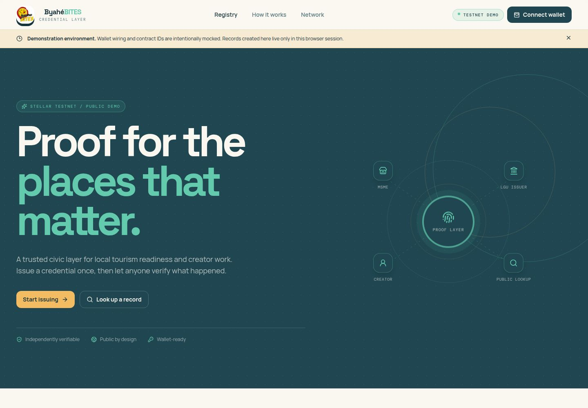
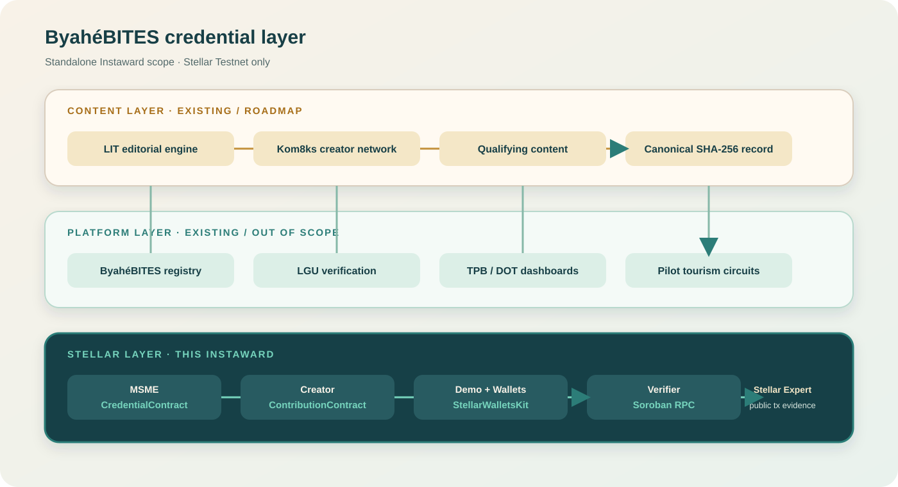

# ByahéBITES Soroban Credential Layer

**Soroban-based credential layer for MSMEs and creators, powering ByahéBITES tourism identity on Stellar Testnet.**

> **Instaward scope:** a standalone, testnet-only 30-day sprint. The two Soroban contracts are deployed and initialized on Stellar Testnet; public IDs, hashes, and checksums are recorded in [`deployments/testnet.json`](../../deployments/testnet.json).

[](https://stellar.expert/explorer/testnet)

## Live demo

**Published demo:** [github-import-jugaway.replit.app](https://github-import-jugaway.replit.app/)

The published demo uses Stellar Wallets Kit and direct Soroban RPC/transaction
flows on Testnet. It is still a prototype: do not represent synthetic QA data
as participant adoption, and do not claim an on-chain result until the wallet
transaction or RPC read has completed successfully.

## Testnet deployment evidence

This evidence snapshot was recorded on **2026-08-31 (UTC)** on **Stellar
Testnet**. The canonical machine-readable record is
[`deployments/testnet.json`](../../deployments/testnet.json); it contains the
same public IDs, transaction hashes, explorer links, and WASM checksums shown
below. No private signing material is included.

| Contract | Contract ID | Deployment transaction | Initialization transaction | WASM SHA-256 |
| --- | --- | --- | --- | --- |
| MSME Credential | [`CBFGWVFTPC5L3NEEZ3XMO6W3MR3X5OKVSYZ5QVL7D5VT4EYZKHBBNSQ3`](https://stellar.expert/explorer/testnet/contract/CBFGWVFTPC5L3NEEZ3XMO6W3MR3X5OKVSYZ5QVL7D5VT4EYZKHBBNSQ3) | [`21382e968dfee7a1c1bc0ad5d427e9ecc7ab52f44e6a199b44e7de4aaf379919`](https://stellar.expert/explorer/testnet/tx/21382e968dfee7a1c1bc0ad5d427e9ecc7ab52f44e6a199b44e7de4aaf379919) | [`972080874e2d51ba467f5c02e725079d5db7c31531bce688df089731b769424f`](https://stellar.expert/explorer/testnet/tx/972080874e2d51ba467f5c02e725079d5db7c31531bce688df089731b769424f) | `8d8ee9aa5c7ecd6f835d9a146d19ab3f04be482b68ffa063e4b486085c74b23d` |
| Creator Contribution | [`CDP3RVMNYOQV4II3SGRCZHSO7DSH57QIDDR3BSYOJ5VMVXOJBR5PV2KP`](https://stellar.expert/explorer/testnet/contract/CDP3RVMNYOQV4II3SGRCZHSO7DSH57QIDDR3BSYOJ5VMVXOJBR5PV2KP) | [`da42bf2c1f0f832fd83f98c96d1dff753e4a822ec74e3a0ebca6a6aecf9c855e`](https://stellar.expert/explorer/testnet/tx/da42bf2c1f0f832fd83f98c96d1dff753e4a822ec74e3a0ebca6a6aecf9c855e) | [`cf0e87e16b9ede2b21614ea1e2e917a2a802d717d12fe50205692cb6c54d5014`](https://stellar.expert/explorer/testnet/tx/cf0e87e16b9ede2b21614ea1e2e917a2a802d717d12fe50205692cb6c54d5014) | `3bba988a5d48aa13c0fe7895f71c8ffb4b0790148e18af4429dc719b3bfb6f15` |

### Reproduce the build and checksum verification

From the repository root:

```bash
export RUSTUP_TOOLCHAIN=1.88.0
cargo test --workspace --locked
stellar contract build --package msme-credential --out-dir target/deploy
stellar contract build --package creator-contribution --out-dir target/deploy
find target/deploy -type f -name '*.wasm' -exec sha256sum {} +
```

The two resulting SHA-256 values must match the checksums in the table and in
[`deployments/testnet.json`](../../deployments/testnet.json). To independently
check any listed deployment or initialization hash without a wallet, use the
Soroban RPC command in the [verification guide](docs/verification-guide.md).



**Product site:** [byahebites.app](https://byahebites.app/)

## Why this matters

ByahéBITES Nearby — “Hanapin ang kainan sa budget mo” — helps pilot LGUs, creators, and tourism stakeholders discover and promote local MSMEs. This sprint adds a public proof layer for the trust signals that currently live in private systems:

- LGU-issued MSME readiness
- Creator contribution proofs
- PSGC-coded tourism jurisdiction
- Circuit participation
- Publicly inspectable verification

The intended result is portable, machine-readable evidence that TPB/DOT, LGUs, creators, and the public can verify without relying on a private platform database, paper certificate, or platform lock-in.

## Sprint deliverables

1. **MSME Credential Contract** — an issuer-allowlisted Soroban contract for PSGC-coded readiness credentials.
2. **Creator Contribution Contract** — a write-once, replay-guarded contract linking creator work to an MSME and circuit by SHA-256 commitment.
3. **Standalone demo** — StellarWalletsKit wallet connection, wallet-signed transaction build/submit flows, credential/contribution flows, and Soroban RPC lookup.
4. **Validation package** — tests, contract IDs, deployment and record transaction hashes, verification guide, screenshots, and a 3–5 minute walkthrough.

## Architecture



This Instaward builds only the Stellar layer and a minimal standalone demo. The ByahéBITES platform, LIT/Kom8ks editorial systems, LGU console, and TPB/DOT dashboards are existing or future systems and are outside this sprint.

## How the proof flow works

1. An allowlisted issuer signs an MSME credential for a wallet, PSGC jurisdiction, readiness status, and circuit.
2. A creator signs a contribution record for a qualifying story, photo set, or comic.
3. The contract stores only the public proof fields and a SHA-256 commitment to the canonical off-chain record.
4. A reviewer reads contract state through Soroban RPC and follows transaction hashes on Stellar Expert Testnet.
5. A repeated `(creator_wallet, content_hash)` write is rejected; uncertain lookups fail closed.

## Public data and trust boundaries

### Written on-chain

- Issuer address
- MSME or creator wallet address
- PSGC jurisdiction code
- Readiness-status enum
- MSME ID and circuit ID where applicable
- SHA-256 content commitment
- Issued or recorded ledger sequence
- Schema version
- Reserved revocation placeholder

### Kept off-chain

- Personal data
- Raw creator submissions
- Unpublished editorial content
- Private LGU assessments
- Business details
- Platform records

A commitment proves that a canonical record matches its recorded hash. It does not by itself prove authorship, copyright ownership, factual accuracy, publication status, or official LGU approval.

### Explicit testnet limitation

For this prototype, the LGU role is represented by a disclosed demo issuer key and an on-chain issuer allowlist. Multisignature LGU governance, issuer rotation, revocation, and dispute processes are future scope. There is no mainnet deployment, token, payout, or custody model in this sprint.

## Quickstart

```bash
pnpm install
pnpm --filter @workspace/byahebites-stellar-integration run dev
```

Open the local URL printed by Vite. The Replit workflow supplies the required port and base path automatically.

The pinned Rust/Soroban toolchain is recorded in `rust-toolchain.toml`. See
[the deployment guide](docs/deployment-guide.md) for release steps and
[the verification guide](docs/verification-guide.md) for wallet-free Testnet
checks.

## Reviewer evidence checklist

- [x] MSME contract source, tests, contract ID, deployment transaction, and initialization transaction
- [x] Contribution contract source, tests, contract ID, deployment transaction, and initialization transaction
- [x] Deployment date, Testnet network, WASM checksums, and verification commands
- [ ] Live demo URL and screenshots
- [ ] Freighter plus one additional Stellar wallet tested
- [ ] Soroban RPC lookup documented with expected output
- [ ] Unauthorized, malformed, invalid-enum, duplicate, overwrite, wrong-network, unavailable-state, and unknown-record tests
- [x] Deployment and initialization transaction hashes in the machine-readable JSON record
- [x] Stellar Expert Testnet link for every deployment and initialization hash
- [ ] 3–5 minute screen-captured walkthrough
- [ ] Participant records where consent and onboarding succeed: target 10 MSMEs, 12 creators, 22 unique wallets

No external MSMEs or creators have been onboarded for this sprint. Any sample
records used for QA are synthetic Testnet fixtures controlled by the team and
are not participant-adoption evidence.

## Known limitations and out-of-scope work

- No mainnet activity
- No token sale, native token, or transferable contribution token
- No creator compensation or settlement
- No credential revocation or dispute workflow
- No LGU multisig console or issuer rotation
- No full ByahéBITES registry, circuit builder, editorial engine, or TPB/DOT dashboard
- No mobile application
- No third-party security audit or formal verification

## Repository map

```text
README.md                                      # public reviewer entry point
artifacts/byahebites-stellar-integration/     # published web demo and docs
contracts/                                    # Soroban contract sources
deployments/testnet.json                      # canonical public evidence
deployments/README.md                         # evidence index and checks
scripts/src/validate-testnet-evidence.ts      # evidence consistency validator
```

## Team and next step

**TAPATGOV / ByahéBITES**

- Joel Wayne Ganibe — System Architect
- Janus Ladero — Soroban / Web3 Engineer
- Ronnie Vivar — Editorial Metadata Lead
- Stellar Philippines — Ambassador Chapter

The deployment evidence and live contract wiring are complete for the Testnet
prototype. Final submission evidence should still include the published build
smoke test, wallet/RPC walkthrough, and any active-engagement materials. No
external MSMEs or creators have been onboarded yet.